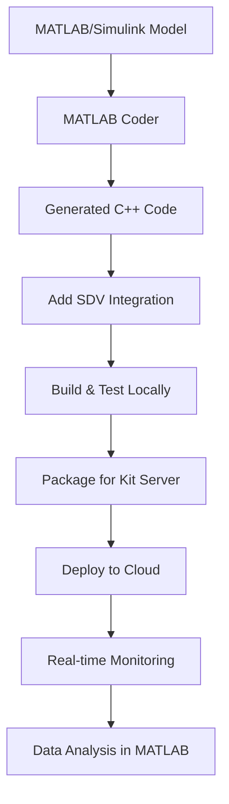

# MATLAB Integration Guide: From Simulink to Kit Server

This guide provides step-by-step instructions for transitioning MATLAB/Simulink vehicle control models to run on the Kit Server platform.

## 🎯 Complete Workflow Overview



## 📋 Prerequisites

### MATLAB Toolboxes Required
- MATLAB Coder
- Simulink Coder (optional)
- Vehicle Dynamics Blockset (recommended)
- Model Predictive Control Toolbox (optional)
- Embedded Coder (for advanced features)

### Development Environment
- C++ compiler (GCC 7+ or Visual Studio 2017+)
- CMake 3.12+
- Git for version control
- Kit Server account

## 🚀 Step-by-Step Transition

### Step 1: Prepare MATLAB Model

#### 1.1 Model Requirements
```matlab
% Ensure your Simulink model meets these requirements:
% - Fixed-step solver (recommended: ode4, 10ms)
% - No unsupported blocks (Scope, To Workspace during generation)
% - All parameters defined in workspace or data dictionary

% Example configuration script:
model_name = 'vehicle_dynamics_model';
open_system(model_name);

% Set solver configuration
set_param(model_name, 'SolverType', 'Fixed-step');
set_param(model_name, 'Solver', 'ode4');
set_param(model_name, 'FixedStep', '0.01');  % 10ms timestep

% Configure for code generation
set_param(model_name, 'RTWSystemTargetFile', 'ert.tlc');
set_param(model_name, 'GenCodeOnly', 'on');
```

#### 1.2 Parameter Management
```matlab
% Create parameter structure (will map to matlab_params.json)
vehicle_params.mass = 1500;                    % kg
vehicle_params.wheel_radius = 0.3;             % m  
vehicle_params.frontal_area = 2.5;             % m^2
vehicle_params.drag_coefficient = 0.3;         % Cd
vehicle_params.rolling_resistance = 0.015;     % coefficient

% PID controller parameters
pid_params.kp = 1000;   % Proportional gain
pid_params.ki = 50;     % Integral gain
pid_params.kd = 100;    % Derivative gain

% Save to workspace
save('vehicle_model_params.mat', 'vehicle_params', 'pid_params');
```

### Step 2: Generate C++ Code

#### 2.1 Configure MATLAB Coder
```matlab
% Create coder configuration
cfg = coder.config('lib');
cfg.TargetLang = 'C++';
cfg.CppNamespace = 'VehicleModel';
cfg.FilePartitionMethod = 'SingleFile';
cfg.GenerateReport = true;
cfg.LaunchReport = true;

% Optimization settings
cfg.EnableOpenMP = false;  % Keep simple for embedded systems
cfg.OptimizeReductions = true;
cfg.SaturateOnIntegerOverflow = false;

% Configure for real-time systems
cfg.HardwareImplementation.ProdHWDeviceType = 'Generic->64-bit Embedded Processor';
```

#### 2.2 Generate Code for Main Functions
```matlab
% Define input/output types for code generation
vehicle_inputs = struct(...
    'throttle_cmd', 0.0, ...     % double
    'brake_cmd', 0.0, ...        % double  
    'target_speed', 16.67);      % double (60 km/h)

vehicle_outputs = struct(...
    'vehicle_speed', 0.0, ...    % double
    'distance_traveled', 0.0, ...% double
    'fuel_consumption', 0.0, ... % double
    'pid_error', 0.0);           % double

% Generate code for main step function
codegen -config cfg -args {vehicle_inputs, vehicle_outputs, 0.01} ...
    vehicle_dynamics_step;

% Generate code for PID controller
pid_states = struct('integral', 0.0, 'prev_error', 0.0);
codegen -config cfg -args {16.67, 10.0, pid_states, 0.01} ...
    pid_controller_step;
```

### Step 3: Integrate Generated Code with SDV Runtime

#### 3.1 Map MATLAB Types to C++
The example shows how to create a `matlab_types.h` file that provides:

```cpp
// MATLAB-compatible types
typedef double real_T;        // MATLAB double
typedef int32_t int32_T;      // MATLAB int32
typedef bool boolean_T;       // MATLAB logical

// MATLAB structure equivalents
struct VehicleParams {
    real_T mass;              // vehicle.mass
    real_T wheel_radius;      // vehicle.wheel_radius
    // ... other parameters
};
```

#### 3.2 Add SDV Monitoring
Replace MATLAB External Mode with SDV shared memory:

```cpp
// Instead of MATLAB External Mode signals
// Add SDV monitoring variables
std::atomic<double> vehicle_speed{0.0};
std::atomic<double> target_speed{16.67};
std::atomic<double> pid_kp{1000.0};

// Initialize SDV monitoring - variables are automatically detected
INIT_SHM();
// No manual WATCH_VAR calls needed - Python syncer handles variable detection
```

#### 3.3 Preserve MATLAB Simulation Loop
```cpp
// Maintain MATLAB-style simulation loop
for (int step = 0; step < MAX_STEPS; step++) {
    double sim_time = step * SIMULATION_TIMESTEP;
    
    // Call MATLAB-generated step function
    vehicle_dynamics_step(inputs, outputs, SIMULATION_TIMESTEP);
    
    // Update SDV monitoring variables
    vehicle_speed = outputs.vehicle_speed;
    target_speed = inputs.target_speed;
    
    // Maintain real-time execution
    std::this_thread::sleep_for(std::chrono::milliseconds(10));
}
```

### Step 4: Build and Test

#### 4.1 Local Testing
```bash
# Build with CMake (similar to MATLAB build process)
mkdir build && cd build
cmake .. -DCMAKE_BUILD_TYPE=Debug
make

# Run simulation (equivalent to MATLAB sim() command)
./vehicle_dynamics_sim

# Verify outputs match MATLAB simulation
```

#### 4.2 Validation Against MATLAB
Create validation script in MATLAB:

```matlab
% Load data exported from C++ simulation
cpp_data = readtable('matlab_vehicle_simulation.csv');

% Run equivalent MATLAB simulation
matlab_results = sim('vehicle_dynamics_model');

% Compare results
figure;
subplot(2,1,1);
plot(cpp_data.timestamp, cpp_data.vehicle_speed, 'b-', ...
     matlab_results.tout, matlab_results.vehicle_speed, 'r--');
legend('C++ Implementation', 'MATLAB/Simulink', 'Location', 'best');
title('Speed Comparison: C++ vs MATLAB');

% Calculate differences
speed_diff = interp1(matlab_results.tout, matlab_results.vehicle_speed, ...
                     cpp_data.timestamp) - cpp_data.vehicle_speed;
max_error = max(abs(speed_diff));
rms_error = sqrt(mean(speed_diff.^2));

fprintf('Validation Results:\n');
fprintf('Max Speed Error: %.4f m/s\n', max_error);
fprintf('RMS Speed Error: %.4f m/s\n', rms_error);

if max_error < 0.1  % 0.1 m/s tolerance
    fprintf('✓ Validation PASSED\n');
else
    fprintf('✗ Validation FAILED\n');
end
```

### Step 5: Deploy to Kit Server

#### 5.1 Package Project
```bash
# Create Kit Server package
zip -r matlab-vehicle-dynamics.zip \
    README.md \
    CMakeLists.txt \
    matlab_params.json \
    include/ \
    src/ \
    test_scenarios/
```

#### 5.2 Deploy and Monitor
1. **Upload**: Go to Kit Server → "New Project" → Upload ZIP
2. **Build**: Kit Server automatically builds using CMakeLists.txt  
3. **Run**: Click "Run Application"
4. **Monitor**: View real-time variables in Kit Server UI
5. **Tune**: Modify PID gains (`pid_kp`, `pid_ki`, `pid_kd`) in real-time

#### 5.3 Real-time Parameter Tuning
| Kit Server Variable | MATLAB Equivalent | Description |
|-------------------|------------------|-------------|
| `pid_kp` | `set_param(pid_block, 'P', value)` | Proportional gain |
| `pid_ki` | `set_param(pid_block, 'I', value)` | Integral gain |
| `pid_kd` | `set_param(pid_block, 'D', value)` | Derivative gain |
| `target_speed` | `set_param(step_block, 'After', value)` | Speed setpoint |
| `control_mode` | Manual switch in Simulink | PID vs Manual |

### Step 6: Data Analysis and Iteration

#### 6.1 Export Results to MATLAB
```matlab
% Download CSV data from Kit Server
data = webread('https://kit-server.io/api/download/simulation_data.csv');

% Or read from downloaded file
data = readtable('vehicle_simulation_results.csv');

% Perform MATLAB analysis
analyze_vehicle_performance(data);
generate_report(data);

% Create new parameter sets based on results
optimized_params = optimize_pid_gains(data);
```

#### 6.2 Iterative Development
```matlab
% Update MATLAB model based on real-world results
update_simulink_parameters(optimized_params);

% Re-generate code with new parameters
regenerate_code_with_new_params();

% Deploy updated version to Kit Server
deploy_to_kit_server('matlab-vehicle-dynamics-v2.zip');
```

## 🔧 Advanced Integration Features

### Multi-Rate Execution
```cpp
// Implement multi-rate execution like Simulink
if (step % 1 == 0) {     // 100 Hz - Control loop
    pid_controller_step();
}
if (step % 10 == 0) {    // 10 Hz - Vehicle dynamics  
    vehicle_dynamics_step();
}
if (step % 100 == 0) {   // 1 Hz - Diagnostics
    diagnostics_step();
}
```

### Lookup Table Implementation
```cpp
// Implement MATLAB 2D lookup tables
class LookupTable2D {
private:
    std::vector<double> x_breakpoints_;
    std::vector<double> y_breakpoints_;
    std::vector<std::vector<double>> table_data_;
    
public:
    double interpolate(double x, double y) {
        // Bilinear interpolation (same as MATLAB)
        return bilinear_interp(x, y, x_breakpoints_, 
                              y_breakpoints_, table_data_);
    }
};

// Usage (equivalent to MATLAB 2-D Lookup Table block)
LookupTable2D engine_map;
double torque = engine_map.interpolate(engine_rpm, throttle_percent);
```

### State Machine Implementation
```cpp
// Implement Stateflow-like state machines
enum class VehicleState {
    IDLE,
    ACCELERATING, 
    CRUISING,
    BRAKING,
    EMERGENCY_STOP
};

class VehicleStateMachine {
    VehicleState current_state_ = VehicleState::IDLE;
    
public:
    void update(const VehicleInputs& inputs) {
        // State transition logic (equivalent to Stateflow)
        switch (current_state_) {
            case VehicleState::IDLE:
                if (inputs.target_speed > 0.1) {
                    current_state_ = VehicleState::ACCELERATING;
                }
                break;
                
            case VehicleState::ACCELERATING:
                if (abs(inputs.target_speed - vehicle_speed) < 0.5) {
                    current_state_ = VehicleState::CRUISING;
                }
                break;
                
            // ... other states
        }
    }
};
```

## 📊 Performance Optimization

### Memory Management
```cpp
// Avoid dynamic allocation (like MATLAB Coder)
constexpr size_t MAX_DATA_POINTS = 10000;
std::array<DataLogEntry, MAX_DATA_POINTS> data_log_;
size_t data_count_ = 0;

// Pre-allocate buffers (MATLAB-style)
std::array<double, MAX_SIMULATION_STEPS> speed_history_;
std::array<double, MAX_SIMULATION_STEPS> time_history_;
```

### Fixed-Point Implementation
```cpp
// For embedded targets (like MATLAB Fixed-Point Designer)
using FixedPoint16_16 = int32_t;  // 16.16 fixed-point

FixedPoint16_16 to_fixed(double value) {
    return static_cast<FixedPoint16_16>(value * 65536.0);
}

double from_fixed(FixedPoint16_16 fixed) {
    return static_cast<double>(fixed) / 65536.0;
}
```

## 🔍 Troubleshooting Guide

### Common Issues and Solutions

| Issue | MATLAB Cause | Kit Server Solution |
|-------|--------------|-------------------|
| Code won't compile | Unsupported MATLAB functions | Use compatible C++ equivalents |
| Variables not updating | External Mode not working | Check Python syncer configuration |
| Performance issues | Large model, complex blocks | Optimize update rates, use lookup tables |
| Different results | Solver differences | Match timestep and solver type |
| Memory errors | Dynamic memory allocation | Use fixed-size arrays |

### Debugging Techniques
```cpp
// Add MATLAB-style debugging
#define MATLAB_DEBUG 1

#if MATLAB_DEBUG
    std::cout << "Debug: vehicle_speed = " << vehicle_speed << std::endl;
    std::cout << "Debug: pid_output = " << pid_output << std::endl;
#endif

// Log to file (equivalent to MATLAB diary)
std::ofstream debug_log("matlab_debug.log");
debug_log << "Step " << step << ": speed=" << vehicle_speed << std::endl;
```

## 📚 Additional Resources

### MATLAB Documentation
- [MATLAB Coder User's Guide](https://mathworks.com/help/coder/)
- [Simulink Coder User's Guide](https://mathworks.com/help/rtw/)
- [Code Generation from MATLAB](https://mathworks.com/help/coder/matlab-code-generation.html)

### Kit Server Integration
- [Kit Server C++ Development Guide](https://docs.kit-server.io/cpp)
- [Shared Memory Monitoring](https://docs.kit-server.io/monitoring)
- [Real-time Parameter Tuning](https://docs.kit-server.io/tuning)

### Automotive Standards
- [ISO 26262 Functional Safety](https://iso.org/standard/68383.html)
- [AUTOSAR Classic Platform](https://autosar.org/)
- [MISRA C++ Guidelines](https://misra.org.uk/)

---

*This integration guide enables MATLAB users to leverage their existing models and expertise while gaining the benefits of cloud-based SDV development, real-time monitoring, and collaborative development workflows.*